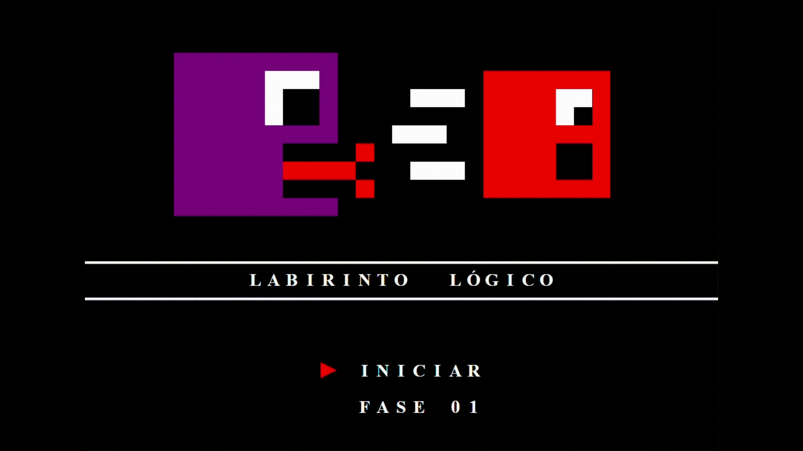

## 🎮 JSGame Labirinto Lógico

  

Bem-vindo ao **JSGame Labirinto Lógico**! Neste repositório, você encontrará um jogo divertido que exige raciocínio lógico e paciência, inspirado nos *Jogos de Labirinto*, *Fuja das Esferas* e outros minigames do Habbo Hotel.

🎲 **[Clique aqui para jogar agora](https://ismaelldiias.github.io/jsgame-labirinto-logico/)**

---

## 🎯 Objetivo

Chegar até o final do labirinto sem ser **pego** pelos monstros.

---

## 🛠️ Tecnologias Utilizadas

- **HTML5** e **CSS3** – Estrutura e aparência do jogo  
- **JavaScript** – Lógica do jogo e interatividade

---

## 🚀 Como Jogar

1. Clone este repositório para sua máquina local.  
2. Abra o arquivo `index.html` em seu navegador web.  
3. Use as **setas do teclado** para mover seu personagem (vermelho) pela arena (amarelo).  
4. Evite colidir com os monstros (roxos); para isso, utilize as zonas seguras (verde).  
5. Em cada fase, você deve chegar até o outro lado do labirinto, onde está a marcação de chegada (azul).  
6. O jogo **encerra** nas seguintes situações:  
   - Se seu personagem **colidir** com algum monstro (**Game Over**).  
   - Se seu personagem chegar até o final do labirinto sem ter colidido com nenhum monstro (**Parabéns, você venceu!**).  
7. Para jogar novamente, basta atualizar a página (**F5**).

---

## 🤝 Contribuição

Contribuições são bem-vindas! Se você deseja melhorar o jogo, adicionar novos recursos ou corrigir bugs, fique à vontade para abrir um **pull request**.
